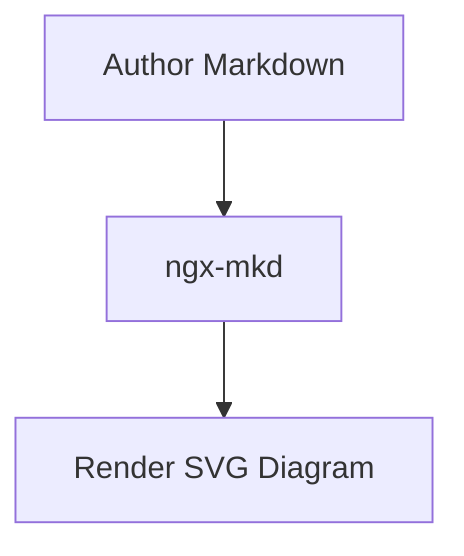

# ngx-mkd / AwesomeMarkdown

一个基于 Angular 的 Markdown 渲染组件库与演示项目。

- `projects/ngx-mkd`：组件库源码
- `projects/demo-ngx-mkd`：演示应用（主题切换、实时编辑、预览）

## 组件特性

- 基于 `marked` 的 Markdown 渲染（GFM + 换行支持）
- 代码块支持 `highlight.js` 语法高亮
	- 指定语言时优先按语言高亮
	- 未指定语言时自动识别高亮
- 支持 Mermaid 图表渲染（```mermaid fenced code block）
- 代码块工具栏
	- 左上角语言标签（默认 `text`）
	- 右上角 `Copy` 按钮
	- 复制成功显示 `Copied`，2 秒后恢复 `Copy`
	- 复制失败输出 `console.error`
- 提供 `MarkdownRenderService`，可独立复用 “markdown -> html” 渲染能力

## 安装

在你的 Angular 项目中安装：

```bash
pnpm add ngx-mkd highlight.js mermaid github-markdown-css
```

> `highlight.js` 与 `mermaid` 为 `ngx-mkd` 的 peer dependency，需要业务项目自行安装。

## 快速使用

### 1) 在组件中引入 `NgxMkdComponent`

```ts
import { Component, signal } from '@angular/core';
import { NgxMkdComponent } from 'ngx-mkd';

@Component({
	selector: 'app-markdown-page',
	imports: [NgxMkdComponent],
	template: `<lib-ngx-mkd [markdown]="markdown()" [theme]="theme()"></lib-ngx-mkd>`
})
export class MarkdownPageComponent {
	protected theme = signal<'light' | 'dark'>('light');
	protected markdown = signal('# Hello ngx-mkd\n\n```ts\nconst ok = true\n```');
}
```

Mermaid 示例：

````md

````

### 2) 引入 markdown 与代码高亮主题（推荐）

按演示项目方式，在 `angular.json` 的 `build.options.styles` 中增加非注入样式包：

```json
[
	"src/styles.css",
	{ "input": "node_modules/github-markdown-css/github-markdown-light.css", "bundleName": "markdown-light", "inject": false },
	{ "input": "node_modules/github-markdown-css/github-markdown-dark.css", "bundleName": "markdown-dark", "inject": false },
	{ "input": "node_modules/highlight.js/styles/github.css", "bundleName": "hljs-light", "inject": false },
	{ "input": "node_modules/highlight.js/styles/github-dark.css", "bundleName": "hljs-dark", "inject": false }
]
```

## 主题配置（以 demo-ngx-mkd 为蓝本）

核心思路：主题切换时动态挂载/更新 `<link>`，分别切换 markdown 与 highlight 主题文件。

```ts
private applyMarkdownTheme(theme: 'light' | 'dark'): void {
	const href = theme === 'dark' ? '/markdown-dark.css' : '/markdown-light.css';
	this.upsertThemeLink('markdown-theme-stylesheet', href);
}

private applyHighlightTheme(theme: 'light' | 'dark'): void {
	const href = theme === 'dark' ? '/hljs-dark.css' : '/hljs-light.css';
	this.upsertThemeLink('highlight-theme-stylesheet', href);
}

private upsertThemeLink(id: string, href: string): void {
	let link = document.getElementById(id) as HTMLLinkElement | null;
	if (!link) {
		link = document.createElement('link');
		link.id = id;
		link.rel = 'stylesheet';
		document.head.appendChild(link);
	}
	if (link.getAttribute('href') !== href) {
		link.setAttribute('href', href);
	}
}
```

完整参考实现：

- 主题切换逻辑：[projects/demo-ngx-mkd/src/app/app.ts](projects/demo-ngx-mkd/src/app/app.ts)
- 主题构建配置：[angular.json](angular.json)

## 可选：单独使用渲染 Service

如果你希望只复用渲染能力（不直接使用组件），可注入 `MarkdownRenderService`：

```ts
import { inject } from '@angular/core';
import { MarkdownRenderService } from 'ngx-mkd';

const markdownRenderService = inject(MarkdownRenderService);
const html = markdownRenderService.render('```js\nconsole.log(1)\n```');
```

> `MarkdownRenderService` 负责把 markdown 转为 html（包括 mermaid block 输出），图表实际绘制由 `NgxMkdComponent` 在渲染后执行。

## 本仓库开发命令

```bash
pnpm start
pnpm ng build ngx-mkd --configuration development
pnpm ng build demo-ngx-mkd --configuration development
pnpm ng test ngx-mkd --watch=false
```
