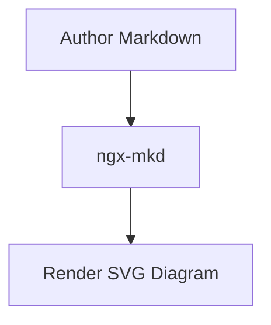

# ngx-mkd / AwesomeMarkdown

[English](README.md) | 简体中文

一个基于 Angular 的 Markdown 渲染组件库与演示应用。

- `projects/ngx-mkd`：组件库源码
- `projects/demo-ngx-mkd`：演示应用（实时编辑、预览、主题切换）

## 功能特性

- 基于 `marked` 的 Markdown 渲染（GFM + 换行）
- 基于 `highlight.js` 的代码高亮
  - 指定语言时优先使用该语言高亮
  - 未指定语言时自动识别
- Mermaid 图表渲染（`mermaid` fenced code block）
- KaTeX 公式渲染（行内 `$...$` 与块级 `$$...$$`）
- 代码块工具栏
  - 语言标签（默认 `text`）
  - `Copy` 按钮
  - 复制成功后显示 `Copied` 2 秒
  - 复制失败输出 `console.error`
- 提供 `MarkdownRenderService`，可单独复用 `markdown -> html` 能力

## 安装

在你的 Angular 项目中安装：

```bash
pnpm add ngx-mkd highlight.js mermaid katex github-markdown-css
```

`highlight.js`、`mermaid`、`katex` 是 `ngx-mkd` 的 peerDependencies，需由业务项目自行安装。

## 快速开始

### 1) 使用 `NgxMkdComponent`

```ts
import { Component, signal } from '@angular/core';
import { NgxMkdComponent } from 'ngx-mkd';

@Component({
  selector: 'app-markdown-page',
  imports: [NgxMkdComponent],
  template: `<lib-ngx-mkd [markdown]="markdown()" [theme]="theme()"></lib-ngx-mkd>`
})
export class MarkdownPageComponent {
  protected theme = signal<'light' | 'dark'>('light');
  protected markdown = signal('# Hello ngx-mkd\n\n```ts\nconst ok = true\n```');
}
```

Mermaid 示例：

````md

````

数学公式示例：

```md
行内：$E = mc^2$

块级：
$$
\int_{0}^{\infty} e^{-x^2} \, dx = \frac{\sqrt{\pi}}{2}
$$
```

### 2) 配置 markdown 与代码高亮主题

参考 demo，在 `angular.json` 的 `build.options.styles` 中添加非注入样式包：

```json
[
  "src/styles.css",
  "node_modules/katex/dist/katex.min.css",
  { "input": "node_modules/github-markdown-css/github-markdown-light.css", "bundleName": "markdown-light", "inject": false },
  { "input": "node_modules/github-markdown-css/github-markdown-dark.css", "bundleName": "markdown-dark", "inject": false },
  { "input": "node_modules/highlight.js/styles/github.css", "bundleName": "hljs-light", "inject": false },
  { "input": "node_modules/highlight.js/styles/github-dark.css", "bundleName": "hljs-dark", "inject": false }
]
```

KaTeX 渲染依赖全局引入 `katex.min.css`。

## 主题切换策略（demo 同款）

demo 通过运行时更新 `<link>` 来切换主题：

```ts
private applyMarkdownTheme(theme: 'light' | 'dark'): void {
  const href = theme === 'dark' ? '/markdown-dark.css' : '/markdown-light.css';
  this.upsertThemeLink('markdown-theme-stylesheet', href);
}

private applyHighlightTheme(theme: 'light' | 'dark'): void {
  const href = theme === 'dark' ? '/hljs-dark.css' : '/hljs-light.css';
  this.upsertThemeLink('highlight-theme-stylesheet', href);
}
```

参考实现：

- `projects/demo-ngx-mkd/src/app/app.ts`
- `angular.json`

## 可选：仅使用渲染 Service

```ts
import { inject } from '@angular/core';
import { MarkdownRenderService } from 'ngx-mkd';

const markdownRenderService = inject(MarkdownRenderService);
const html = markdownRenderService.render('```js\nconsole.log(1)\n```');
```

`MarkdownRenderService` 负责把 markdown 转为 HTML（包含 mermaid 占位结构）；图表实际绘制由 `NgxMkdComponent` 在 DOM 更新后执行。

## 开发命令

```bash
pnpm start
pnpm ng build ngx-mkd --configuration development
pnpm ng build demo-ngx-mkd --configuration development
pnpm ng test ngx-mkd --watch=false
node --expose-gc scripts/benchmark-markdown-render.mjs
```
