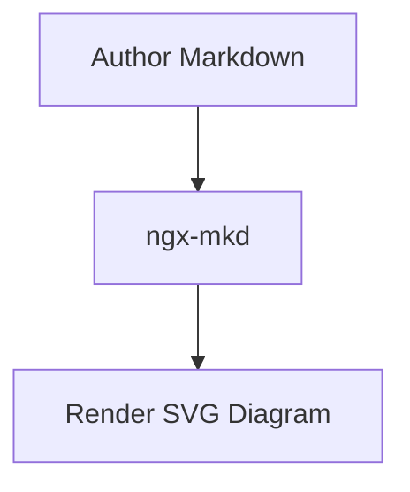

# ngx-mkd / AwesomeMarkdown

English | [简体中文](README.zh-CN.md)

An Angular markdown rendering library with a demo application.

- `projects/ngx-mkd`: library source
- `projects/demo-ngx-mkd`: demo app (live editor, preview, theme switching)

## Features

- Markdown rendering with `marked` (GFM + line breaks)
- Syntax highlighting with `highlight.js`
   - Uses language-specific highlighting when language is provided
   - Falls back to auto-detection when language is missing
- Mermaid diagram rendering from fenced `mermaid` code blocks
- KaTeX math rendering for inline `$...$` and block `$$...$$`
- Code block toolbar
   - Language label (`text` by default)
   - `Copy` button
   - `Copied` state for 2 seconds after success
   - Failed copy logs `console.error`
- `MarkdownRenderService` for reusable `markdown -> html` conversion

## Installation

Install in your Angular project:

```bash
pnpm add ngx-mkd highlight.js mermaid katex github-markdown-css
```

`highlight.js`, `mermaid`, and `katex` are peer dependencies and must be installed by consumers.

## Quick start

### 1) Use `NgxMkdComponent`

```ts
import { Component, signal } from '@angular/core';
import { NgxMkdComponent } from 'ngx-mkd';

@Component({
   selector: 'app-markdown-page',
   imports: [NgxMkdComponent],
   template: `<lib-ngx-mkd [markdown]="markdown()" [theme]="theme()"></lib-ngx-mkd>`
})
export class MarkdownPageComponent {
   protected theme = signal<'light' | 'dark'>('light');
   protected markdown = signal('# Hello ngx-mkd\n\n```ts\nconst ok = true\n```');
}
```

Mermaid example:

````md

````

Math example:

```md
Inline: $E = mc^2$

Block:
$$
\int_{0}^{\infty} e^{-x^2} \, dx = \frac{\sqrt{\pi}}{2}
$$
```

### 2) Configure markdown and highlight themes

Follow the demo setup by adding non-injected style bundles in `angular.json`:

```json
[
   "src/styles.css",
   "node_modules/katex/dist/katex.min.css",
   { "input": "node_modules/github-markdown-css/github-markdown-light.css", "bundleName": "markdown-light", "inject": false },
   { "input": "node_modules/github-markdown-css/github-markdown-dark.css", "bundleName": "markdown-dark", "inject": false },
   { "input": "node_modules/highlight.js/styles/github.css", "bundleName": "hljs-light", "inject": false },
   { "input": "node_modules/highlight.js/styles/github-dark.css", "bundleName": "hljs-dark", "inject": false }
]
```

KaTeX rendering requires `katex.min.css` in global styles.

## Theme switching strategy (used by demo)

The demo switches themes by updating `<link>` tags at runtime:

```ts
private applyMarkdownTheme(theme: 'light' | 'dark'): void {
   const href = theme === 'dark' ? '/markdown-dark.css' : '/markdown-light.css';
   this.upsertThemeLink('markdown-theme-stylesheet', href);
}

private applyHighlightTheme(theme: 'light' | 'dark'): void {
   const href = theme === 'dark' ? '/hljs-dark.css' : '/hljs-light.css';
   this.upsertThemeLink('highlight-theme-stylesheet', href);
}
```

Reference implementation:

- `projects/demo-ngx-mkd/src/app/app.ts`
- `angular.json`

## Optional: Use render service directly

```ts
import { inject } from '@angular/core';
import { MarkdownRenderService } from 'ngx-mkd';

const markdownRenderService = inject(MarkdownRenderService);
const html = markdownRenderService.render('```js\nconsole.log(1)\n```');
```

`MarkdownRenderService` converts markdown to HTML (including mermaid placeholders); actual diagram rendering is handled by `NgxMkdComponent` after DOM update.

## Development commands

```bash
pnpm start
pnpm ng build ngx-mkd --configuration development
pnpm ng build demo-ngx-mkd --configuration development
pnpm ng test ngx-mkd --watch=false
node --expose-gc scripts/benchmark-markdown-render.mjs
```
